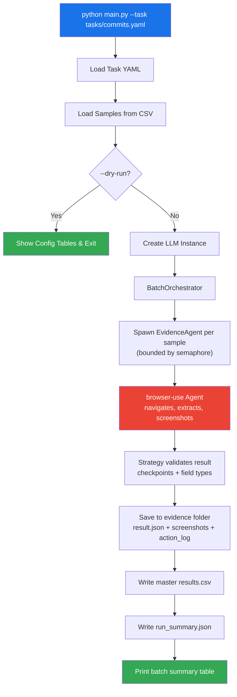
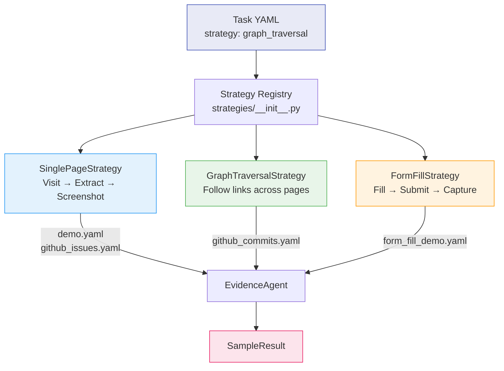
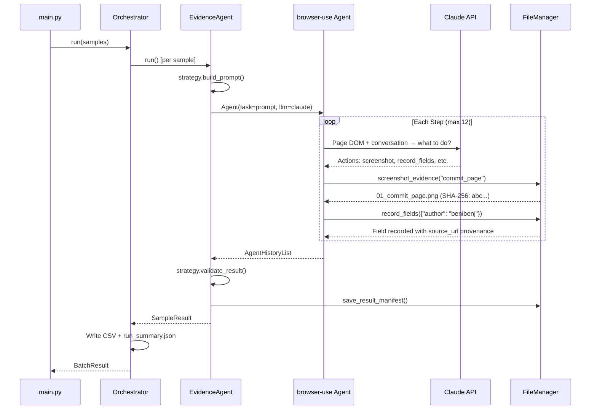
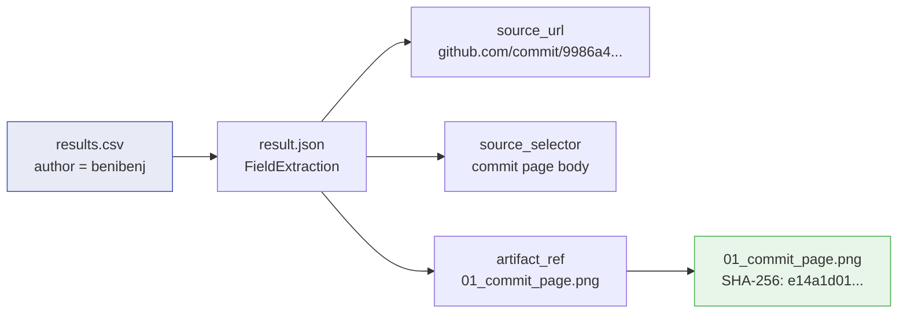

# Architecture Diagrams — Browser Evidence Agent

Visual explanations of how the application works, for demos and code reviews.

---

## 1. High-Level Flow — What Happens When You Run a Task



---

## 2. Agentic vs Deterministic Split — The Core Design Decision

```mermaid
flowchart LR
    subgraph AGENTIC["🤖 LLM Decides (Non-deterministic)"]
        direction TB
        A1[Which page to visit next]
        A2[What fields to extract]
        A3[Which links to follow]
        A4[How to fill form fields]
        A5[Audit judgment reasoning]
    end

    subgraph DETERMINISTIC["⚙️ Python Handles (Deterministic)"]
        direction TB
        D1[File naming: 01_commit_page.png]
        D2[SHA-256 hash computation]
        D3[Folder structure creation]
        D4[CSV column ordering]
        D5[Checkpoint verification]
        D6[Field type coercion]
    end

    AGENTIC -->|"raw data"| DETERMINISTIC
    DETERMINISTIC -->|"audit-grade output"| OUT[Evidence Folder]

    style AGENTIC fill:#fff3e0,stroke:#ff9800
    style DETERMINISTIC fill:#e8f5e9,stroke:#4caf50
    style OUT fill:#e3f2fd,stroke:#2196f3
```



**Why this matters:** Same evidence collected twice = same files, same names, same hashes. The LLM can be creative in HOW it gets there, but the output is always consistent. This is critical for audit work.

---

## 3. Strategy Pattern — How Task Types Are Handled



**Key point:** New task in existing family = YAML only. New task family = one strategy class + YAML.

---

## 4. Evidence Collection Pipeline — One Sample, End to End



---

## 5. Data Flow — From YAML to Evidence Folder

```
INPUT                          PROCESSING                      OUTPUT
─────                          ──────────                      ──────

tasks/commits.yaml             ┌─────────────┐
  ├─ name                      │  TaskConfig  │
  ├─ strategy ─────────────────│  (Pydantic)  │
  ├─ instructions              └──────┬───────┘
  ├─ output_fields                    │
  └─ checkpoints                      │
                                      ▼
tasks/inputs/commits.csv       ┌─────────────┐        evidence/run_TIMESTAMP/
  ├─ sample_id                 │  Orchestrator│        ├─ results.csv
  └─ url ──────────────────────│  (asyncio)   │────────├─ run_summary.json
                               └──────┬───────┘        └─ samples/
                                      │                    └─ commit_001/
.env                                  │                       ├─ 01_commit_page.png
  ├─ LLM_PROVIDER              ┌──────▼───────┐              ├─ 02_pr_review.png
  └─ API_KEY ──────────────────│ EvidenceAgent │              ├─ result.json
                               │ + browser-use │              └─ action_log.json
                               └───────────────┘
```

---

## 6. Provenance Chain — How Every Field Traces Back to Source



**Auditor can trace:** CSV value → result.json field → source URL + DOM selector → supporting screenshot (integrity-verified by SHA-256 hash).

---

## 7. ASCII Overview — The Complete System

```
┌─────────────────────────────────────────────────────────────────────┐
│                        BROWSER EVIDENCE AGENT                        │
├─────────────────────────────────────────────────────────────────────┤
│                                                                      │
│  INPUT LAYER                                                         │
│  ┌──────────────┐  ┌────────────────┐  ┌──────────────────────┐     │
│  │  Task YAML   │  │  Input CSV     │  │  .env (API keys)     │     │
│  │  (what to do) │  │  (sample URLs) │  │  (LLM provider)     │     │
│  └──────┬───────┘  └──────┬─────────┘  └──────────┬───────────┘     │
│         └────────────┬─────┘                       │                 │
│                      ▼                             │                 │
│  ORCHESTRATION LAYER                               │                 │
│  ┌──────────────────────────────────┐              │                 │
│  │  BatchOrchestrator               │              │                 │
│  │  • Concurrent samples (semaphore)│              │                 │
│  │  • Fault isolation per sample    │              │                 │
│  │  • Progress logging (Rich)       │              │                 │
│  └──────────────┬───────────────────┘              │                 │
│                 ▼                                   │                 │
│  AGENT LAYER                                       │                 │
│  ┌──────────────────────────────────┐    ┌─────────▼──────────┐     │
│  │  EvidenceAgent (one per sample)  │    │  LLM Factory       │     │
│  │  • Strategy-driven prompts       │◄───│  Anthropic/OpenAI/ │     │
│  │  • Timeout + retry logic         │    │  Gemini/browser-use│     │
│  │  • Checkpoint tracking           │    └────────────────────┘     │
│  └──────────────┬───────────────────┘                               │
│                 ▼                                                     │
│  BROWSER LAYER                                                       │
│  ┌──────────────────────────────────┐                               │
│  │  browser-use Agent               │    CUSTOM ACTIONS:             │
│  │  • DOM extraction (accessibility │    • screenshot_evidence       │
│  │    tree, not raw HTML)           │    • record_fields             │
│  │  • Navigation (click, scroll,    │    • mark_checkpoint           │
│  │    form fill, follow links)      │    • make_judgment             │
│  │  • ReAct reasoning loop          │    • download_file             │
│  └──────────────┬───────────────────┘                               │
│                 ▼                                                     │
│  OUTPUT LAYER (Deterministic — no LLM)                               │
│  ┌──────────────────────────────────────────────────────────────┐    │
│  │  FileManager          │  CSVWriter         │  Summaries      │    │
│  │  • Sequential naming  │  • Batch write     │  • run_summary  │    │
│  │  • SHA-256 hashing    │  • Sorted by ID    │  • Checkpoint   │    │
│  │  • result.json        │  • Typed columns   │    pass rates   │    │
│  │  • action_log.json    │                    │  • Error breakdown│   │
│  └───────────────────────┴────────────────────┴─────────────────┘    │
│                                                                      │
├─────────────────────────────────────────────────────────────────────┤
│  STRATEGY PATTERN                                                    │
│  ┌─────────────┐  ┌──────────────────┐  ┌────────────────┐         │
│  │ single_page │  │ graph_traversal  │  │  form_fill     │         │
│  │ Visit+Extract│  │ Follow links     │  │  Fill+Submit   │         │
│  │             │  │ across pages     │  │  +Download     │         │
│  └─────────────┘  └──────────────────┘  └────────────────┘         │
│  New task = YAML only | New family = 1 strategy class + YAML        │
└─────────────────────────────────────────────────────────────────────┘
```
