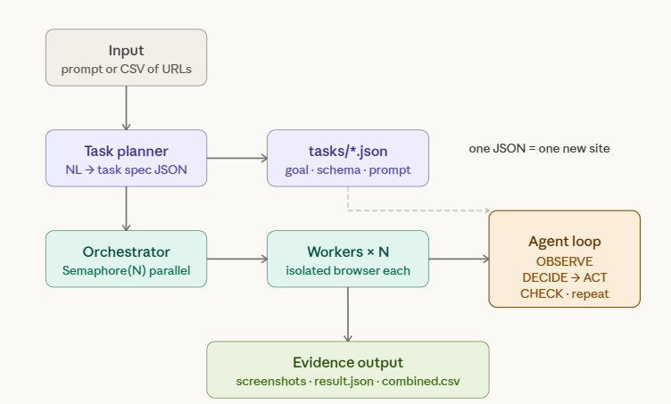
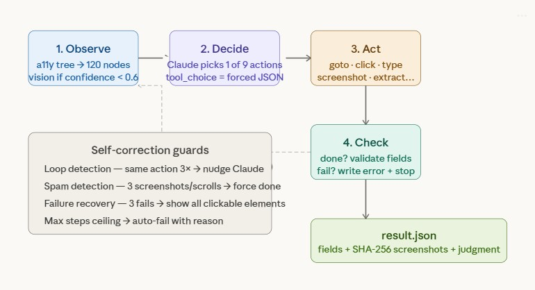

# How It Works — Technical Overview

## System Flow

```
User Input                          Output
─────────                          ──────
"--prompt 'Go to X and extract Y'"  evidence/run_XXXX/
  or                                  ├── sample_001/
"--task spec.json --input data.csv"   │   ├── 01_page.png    (SHA-256 hashed)
                                      │   ├── result.json    (extracted fields)
         │                            │   └── action_log.json (step trace)
         ▼                            ├── sample_002/...
┌─────────────────┐                   └── combined.csv
│  TASK PLANNER   │ (--prompt only)
│  Claude converts│
│  plain English  │
│  → task spec    │
│  → sample URLs  │
└────────┬────────┘
         │
         ▼
┌─────────────────┐
│  ORCHESTRATOR   │  main.py
│  Load samples   │
│  Skip completed │  ← idempotent restart
│  Launch workers │
└────────┬────────┘
         │
         ├──────────────┬──────────────┐
         ▼              ▼              ▼
┌──────────────┐ ┌──────────────┐ ┌──────────────┐
│   WORKER 1   │ │   WORKER 2   │ │   WORKER N   │
│ BrowserCtx   │ │ BrowserCtx   │ │ BrowserCtx   │  ← isolated sessions
│   (sample A) │ │   (sample B) │ │   (sample N) │
└──────┬───────┘ └──────┬───────┘ └──────┬───────┘
       │                │                │
       ▼                ▼                ▼
┌──────────────────────────────────────────────────┐
│              AGENT LOOP (per sample)              │
│                                                   │
│  for step in range(max_steps):                    │
│                                                   │
│    ┌─────────┐   ┌─────────┐   ┌─────────┐      │
│    │ OBSERVE │──▶│ DECIDE  │──▶│  ACT    │      │
│    │         │   │         │   │         │      │
│    │ DOM     │   │ Claude  │   │Playwright│      │
│    │ a11y    │   │ tool_use│   │ goto     │      │
│    │ tree    │   │ returns │   │ click    │      │
│    │ pruned  │   │ 1 of 10 │   │ type     │      │
│    │ to ~80  │   │ actions │   │ screenshot│     │
│    │ nodes   │   │         │   │ done/fail│      │
│    └─────────┘   └─────────┘   └─────────┘      │
│         ▲                           │             │
│         └───────────────────────────┘             │
│              loop until done/fail                 │
└──────────────────────────────────────────────────┘
         │
         ▼
┌─────────────────┐
│  MERGE CSV      │  main.py reads all result.json
│  Sort by ID     │  → combined.csv
└─────────────────┘
```



## Component-by-Component

### 1. Task Planner (`task_planner.py`)

Only used with `--prompt`. Calls Claude once to convert natural language into:

```
Input:  "Go to torvalds GitHub and extract name, followers, pinned repos"
Output: {
  task_spec: { system_prompt, goal, output_schema, keywords, max_steps... },
  samples:   [{ sample_id: "torvalds", url: "https://github.com/torvalds" }]
}
```

The generated spec is saved to `evidence/run_XXXX/generated_task_spec.json` for inspection. After this, execution is identical to using a pre-built `--task` JSON file.

### 2. Orchestrator (`main.py`)

Coordinates the run:

- Loads task spec (from file or planner)
- Loads samples (from CSV, `--url`, or planner)
- Checks `evidence/run_XXXX/` for already-completed samples → skips them (`--resume`)
- Launches N workers via `asyncio.gather` + `Semaphore(N)` for bounded concurrency
- After all workers finish: merges all `result.json` → `combined.csv`

### 3. Worker (`worker.py`)

One worker per sample. Creates an **isolated BrowserContext** — own cookies, own session, no bleed between workers. If `auth_profile` is set (e.g., LinkedIn), loads saved cookies into the context.

```python
ctx = await browser.new_context(color_scheme="light", storage_state=auth_file)
page = await ctx.new_page()
await agent_loop.run(page, sample, task_spec, output_mgr)
```

All exceptions caught → written to `result.json`. Worker never crashes the batch.

### 4. Agent Loop (`agent_loop.py`) — The Brain



A ReAct cycle that repeats until `done`, `fail`, or `max_steps`:

**OBSERVE** — DOM extractor reads the page's accessibility tree via Playwright's `aria_snapshot()`. Raw tree (~2000 nodes) is pruned through 4 passes:

```
Pass 1: Skip navigation/banner/footer blocks (entire subtrees removed)
Pass 2: Keep semantic roles only (link, button, heading, textbox, checkbox...)
Pass 3: Boost nodes matching task keywords, keep links/buttons always
Pass 4: Trim to 120 nodes max
```

Result: compact indexed text like:

```
[0] [heading]  "Linus Torvalds"
[1] [link]     "linux" → https://github.com/torvalds/linux
[2] [button]   "Follow"
[3] [textbox]  "Search" (value="hello")   ← current input values enriched
```

If `dom_confidence < 0.6` (canvas/SVG-heavy pages), vision activates — takes a screenshot and asks Claude a targeted question.

**DECIDE** — Sends to Claude via Anthropic SDK:

- `system`: task spec's system_prompt (static, prompt-cached across steps)
- `messages`: one user message with page state + budget-fitted history (5-25 items) + goal + output schema + reflection context
- `tools`: 10 action definitions (each with optional reflection fields)
- `tool_choice: {"type": "any"}` — forces structured output, never prose

Claude returns one or more tool calls. Each includes optional structured reflection:
- `evaluation_previous_step`: did the last action work?
- `memory_update`: key fact to carry forward
- `next_goal`: what the agent intends next

When `ENABLE_MULTI_ACTIONS=true`, multiple actions can execute per LLM call (max 3 by default).

**ACT** — Dispatches the action to Playwright:

| Action                 | Playwright Call                | Element Resolution                          |
| ---------------------- | ------------------------------ | ------------------------------------------- |
| `goto(url)`            | `page.goto()`                  | Direct URL                                  |
| `click(selector)`      | 3-strategy: index → text → CSS | `page.get_by_role()` / `page.get_by_text()` |
| `type(selector, text)` | `page.fill()`                  | Same 3-strategy                             |
| `scroll(direction)`    | `page.mouse.wheel()`           | N/A                                         |
| `screenshot(label)`    | `page.screenshot()`            | N/A, saves with SHA-256                     |
| `extract(selector)`    | `locator.inner_text()`         | Same 3-strategy                             |
| `wait(selector)`       | `wait_for_selector()`          | Text or CSS                                 |
| `done(extracted)`      | Validates + writes result      | N/A                                         |
| `fail(note)`           | Writes failure + exits         | N/A                                         |
| `save_progress(extracted, note)` | Checkpoint data, continue | N/A, deep-merges with previous |

Every action returns `ActionResult(success, description, error)` — never raises. Each dispatch is wrapped in a 60-second timeout to prevent hung workers.

**CHECK** — When agent calls `done`:

1. Verify `required_fields` are present and not None (but 0/false are valid)
2. Verify `required_artifacts` labels match saved screenshot filenames
3. If missing + steps remain → bounce back with notice
4. If missing + last step → write `needs_review`
5. If all good → write `result.json` + `action_log.json`

**SELF-CORRECTION (Escalating Recovery):**

The agent has a multi-layered recovery system inspired by browser-use's decision hygiene:

- **Structured reflection**: every action includes `evaluation_previous_step`, `memory_update`, and `next_goal` fields — explicit working memory instead of incidental text
- **Stagnation detection**: page signature (URL + DOM hash) tracked across steps. Same page + no new data triggers escalation:
  - **Level 1** (3 steps stagnant): gentle nudge — "try a different approach"
  - **Level 2** (5 steps stagnant): forceful demand — "CHANGE YOUR STRATEGY NOW" + checkpoint saved
  - **Level 3** (8 steps stagnant): forced consolidation — "MUST call done or fail"
- **Budget pressure warnings**: one-time notices at 75% ("start consolidating") and 90% ("save/finalize NOW") of step budget
- **Last-step tool restriction**: on the final step, only `done` and `fail` are available — no wasted actions
- **Spam detection**: 4+ identical action types on the same URL → forced stop
- **Failure recovery**: 3+ consecutive failures → inject list of visible interactive elements
- **Final consolidation**: when max_steps exhausted or LLM fails with accumulated data, one last LLM call produces best-effort structured output

### 5. DOM Extractor (`core/dom_extractor.py`)

Primary perception. Converts browser page into LLM-digestible text.

```
aria_snapshot() → parse YAML → filter semantic → keyword boost → trim → enrich input values
```

**Input value enrichment**: Reads current values from live `<input>` elements via JavaScript and attaches them to DOM nodes. This prevents the agent from re-filling already-filled form fields.

**CDP fallback**: If `aria_snapshot()` returns < 5 nodes (broken a11y tree), falls back to Chrome DevTools Protocol `Accessibility.getFullAXTree`.

**DOM confidence**: A penalty score starting at 1.0, computed by injecting JavaScript into the live page:

```
score = 1.0
score -= 0.3 × (canvas_count / total_nodes)        # <canvas> elements are black boxes to the a11y tree
score -= 0.2 × (missing_aria_labels / interactive)  # icon-only buttons with no text and no aria-label
score -= 0.1 × (svg_count / interactive)            # SVG status icons (✓/✗) have no text equivalent
if semantic_nodes < 10: score -= 0.3                 # barely any meaningful elements found
```

- **canvas_count**: `document.querySelectorAll('canvas').length` — charts, maps, drawing apps are invisible to DOM
- **missing_aria_labels**: buttons/links/inputs that have _no_ `aria-label` and _no_ visible text (e.g., `<button><svg>...</svg></button>` — a hamburger menu icon). The agent can't click what it can't name
- **svg_count**: SVGs often represent visual-only status indicators (green checkmark, red X) that the DOM sees as `[img]` with no text
- **semantic_nodes**: count of nodes with meaningful roles (heading, link, button, textbox, etc). Below 10 = page is mostly canvas/images or still loading

Normal pages (GitHub, LinkedIn) score ~0.9. A dashboard with SVG charts and icon buttons might score 0.4 — that triggers vision.

### 6. Vision Module (`core/vision.py`)

Activated when `dom_confidence < 0.6`. The question sent to Claude is **targeted, not open-ended** — it tells Claude exactly what the DOM already captured and asks what's missing:

```python
f"The DOM shows interactive elements but some visual information is missing. "
f"Based on the task goal: '{task_goal}', "
f"what information is visible in this screenshot that the following DOM text does not capture?\n\n"
f"DOM text:\n{dom_context[:1000]}\n\n"
f"Focus on: status icons, color-coded badges, visual indicators, "
f"and any text rendered as images or SVGs."
```

It's not "describe this page." It's: "here's what the DOM already captured, here's the task goal — what **visual** info is the DOM missing?"

**Example**: Task is "check CI pipeline status." The page has green/red SVG checkmarks next to build steps. The DOM only sees `[img]` or `[svg]` with no text. Vision sees the screenshot and responds: _"The icon next to 'build/test' is a green checkmark — status is passing."_

**The flow**: our code reads DOM → our code computes confidence → if low, our code takes a screenshot + builds the targeted question → Claude vision answers → the answer is appended to the DOM text that goes into the DECIDE step.

Uses `AsyncAnthropic` with shared module-level client for connection pooling.

### 7. Output (`tools/output.py`)

Deterministic evidence packaging per sample:

- Screenshots: `{counter:02d}_{label}.png` — sequential, never renamed
- SHA-256 hash computed at write time, stored in `result.json`
- Atomic writes: `.tmp` → `Path.replace()` — no partial files on crash
- Download filenames sanitized (path traversal prevention)
- `combined.csv`: single merge at batch end, sorted by sample_id, non-scalar values JSON-serialized

### 8. Rate Limiting (`tools/browser.py`)

Per-domain throttling via `asyncio.Lock`:

```python
RATE_LIMITS = {
    "linkedin.com": 3.0s,
    "github.com":   0.5s,
    "default":      0.2s,
}
```

Concurrency-safe — all workers share one event loop, one lock.

## Long-Horizon Task Support

Standard tasks (profile extraction, single-page audit) complete in 2-10 steps. Long-horizon tasks (multi-page audits, cross-link navigation chains) need 30-50+ steps. Multiple mechanisms make this work:

### 1. `save_progress` Action

A 10th agent action. Checkpoints partial data **without stopping** the loop:

```
Step 8:  save_progress({ "prs": [{ "title": "Fix editor...", "author": "alice" }] })
         → checkpoint.json updated, agent continues
Step 16: save_progress({ "prs": [{ "title": "Refactor sync...", "author": "bob" }] })
         → data merged with previous checkpoint, agent continues
Step 22: done({ "total_prs_audited": 2, "all_checks_passed": true })
         → accumulated + final data merged → result.json
```

Data is **deep-merged** across calls — arrays append, dicts recurse. If the agent crashes at step 20, `checkpoint.json` has all data from steps 8 and 16.

### 2. Live `checkpoint.json`

Written to the sample's evidence folder every 5 steps and on every `save_progress` call. You can watch it update in real-time:

```json
{
  "sample_id": "pr_chain_audit",
  "status": "in_progress",
  "step": 16,
  "accumulated_data": {
    "prs": [
      { "title": "Fix editor crash", "author": "alice", "reviewers": ["bob"] },
      { "title": "Refactor sync module", "author": "bob", "reviewers": ["alice", "carol"] }
    ]
  },
  "progress_notes": ["Completed PR #1 of 5", "Completed PR #2 of 5"],
  "artifacts_so_far": [{"filename": "01_pr_overview.png", "sha256": "..."}],
  "steps_logged": 16,
  "updated_at": "2026-03-27T18:30:00Z"
}
```

Monitor it live: `watch -n 1 cat evidence/run_XXXX/sample_id/checkpoint.json`

### 3. LLM-Powered Step Summary

Every 10 steps, Claude (fast model — Haiku) summarizes the old history into 2-3 sentences:

```
Steps 1-10: Navigated to the merged PR list, clicked into PR #305569 by benibenj.
Extracted title, author, and reviewer (justschen). Took screenshot of PR overview.
Saved progress with PR #1 data and navigated back to the list.
```

The agent always sees in its prompt:
- **Structured LLM summaries** of earlier work (FOUND/GAPS/NEXT format)
- **Dynamic budget-fitted recent actions** (5-25 items, importance-scored)
- **Full accumulated data** from save_progress (what was collected)
- **Structured run state** (failed URLs, blocked selectors, dead ends, exhausted pages)
- **Step budget** ("Step 16 of 40 — 24 remaining")
- **Budget warnings** at 75% and 90% thresholds
- **Memory hints** from successful past runs on the same domain (first 3 steps only)
- **Reflection context** from recent actions (memory updates, goals)

Uses the fast/cheap model so summary calls cost < $0.001 each.

### 4. Auto-Pagination

When the agent clicks a "Next", "Load more", "Page 2", etc., the system detects it and grants **+3 bonus steps** to the step budget. This means pagination doesn't eat into the task's working budget:

```
Step 15 | click("Next page") → OK → Pagination detected → +3 bonus (effective_max=43)
Step 25 | click("Load more")  → OK → Pagination detected → +3 bonus (effective_max=46)
```

Detection is keyword-based: `next`, `next page`, `load more`, `show more`, `older`, `newer`, `»`, `›`, etc.

### 5. Watchdog + Escalating Stagnation Detection

Replaces the original flat watchdog with a 3-level escalating system using page signature hashing:

- **Page signature** = MD5 of (normalized URL + first 2K of DOM text)
- Same signature + no new data → stagnation counter increments

| Level | Trigger | Response |
|-------|---------|----------|
| 1 (gentle) | 3 stagnant steps | "Try a different approach, scroll, or extract" |
| 2 (forceful) | 5 stagnant steps | "CHANGE YOUR STRATEGY NOW" + checkpoint saved |
| 3 (critical) | 8 stagnant steps | "MUST call done or fail. No more browsing." |

The watchdog resets when genuinely new data arrives (successful `extract` or `save_progress` with new data).

### 6. Batch Chunking (Large-Scale Tasks)

For tasks involving 10+ items with individual URLs (e.g., "extract all 200 org members"), the planner can flag `needs_discovery: true`. The orchestrator then:

1. Runs a **discovery phase** — one agent paginates the listing page, collects all URLs
2. Each discovered URL becomes a **separate parallel sample**
3. Samples are distributed across N concurrent workers

This means a "200 org members" task becomes 200 parallel workers (bounded by concurrency limit), each doing a simple 3-5 step extraction — much faster and more reliable than one agent doing 500+ steps.

### 7. Smart Termination

The agent doesn't just stop at `max_steps`. Multiple termination conditions are checked **before every step**:

| Trigger | Status | Logic |
|---------|--------|-------|
| Agent calls `done` + all requirements met | `done` | Machine-verified fields + artifacts |
| Agent calls `done` + array count < `expected_items` | `partial_success` | Got some but not all items |
| Wall-clock timeout (`max_time_seconds`) | `partial_success` or `failed` | Real time limit for long-running tasks |
| Network circuit breaker (5 consecutive infra errors) | `partial_success` or `failed` | Site down, DNS failure, browser crash |
| Watchdog stall (5 steps, no new data) | warning injected | Agent gets hard nudge to produce data or stop |
| `max_steps` exhausted | `failed` | Hard ceiling (accumulated data saved) |
| LLM API error | `failed` | Claude unreachable |
| Agent calls `fail(reason)` | `failed` | Agent gives up intentionally |
| Budget 75% reached | warning injected | "Start consolidating results" |
| Budget 90% reached | warning injected | "Save/finalize NOW" |
| Final step | tools restricted | Only `done` and `fail` available |
| LLM API error (with data) | `partial_success` | Final consolidation attempted first |
| `max_steps` exhausted (with data) | `partial_success` | Final consolidation attempted first |

**Infrastructure error detection** classifies errors as infra (timeout, DNS, connection refused, page crashed, SSL) vs logic (element not found, click failed). Only infra errors count toward the circuit breaker — a click failing because the wrong selector was used does NOT trigger early termination.

**`partial_success` status** — when the agent collected some data but couldn't finish (e.g., 4 of 5 PRs audited, then the 5th page 404'd), the result is `partial_success` not `failed`. The accumulated data is preserved in `result.json`.

**`expected_items`** — task specs can set `expected_items: 5`. When `save_progress` is called 5 times, the agent gets a nudge: "All items collected. Call done now." The final `done` validation also checks array lengths against this count.

New task spec fields:

```json
{
  "max_steps": 50,
  "max_time_seconds": 300,
  "expected_items": 5,
  "max_consecutive_network_errors": 5
}
```

### 8. Crash Recovery

If the agent hits any termination condition, accumulated data is **not lost**:
- `checkpoint.json` has the latest checkpoint (written on every termination)
- `result.json` includes accumulated data (with appropriate status)
- `action_log.json` has the full step trace up to the termination point

### 9. Long-Term Memory (`memory.py`)

Cross-run learning. The agent remembers what worked and what failed on each domain.

| Type | File | Learned from | Contains |
|------|------|-------------|----------|
| Procedural patterns | `memory/patterns.json` | Successful `done` runs | Action sequences, navigation tips, things to avoid |
| Episodic warnings | `memory/failures.json` | `failed` / `partial_success` runs | Dead URLs, broken selectors, failure reasons |

**How it works:**
- After a successful run, Claude Haiku distills the full action log into abstract navigation patterns
- Patterns are domain-keyed and task-aware — `get_hints()` ranks by keyword overlap with the current goal
- Failure warnings are stored from any non-`done` termination
- Hints are injected into the prompt for the first 3 steps of future runs on the same domain

### 10. Multi-Action Batching (Experimental)

When `ENABLE_MULTI_ACTIONS=true`, the LLM can return multiple actions per step:

- **Max 3 actions per step** (configurable via `MAX_ACTIONS_PER_STEP`)
- **Batch-breaking actions**: `goto`, `done`, `fail`, `save_progress` abort remaining batch
- **URL change aborts batch**: if a click causes navigation, remaining actions are stale
- **DOM stability check**: if interactive element count shifts >20%, batch aborts (prevents stale index targeting)
- **Per-sub-action logging**: every sub-action gets its own `StepRecord` in `action_log.json`
- **Fresh DOM per sub-action**: element map refreshed before each dispatch

Best for: form fills (`type` + `type` + `click`), repetitive extraction. Off by default.

### 11. Fallback LLM

When `ENABLE_FALLBACK_LLM=true` and the primary model fails with retryable errors:
- Primary model retried 3x with exponential backoff
- One attempt on `FALLBACK_LLM_MODEL` (default: Claude Haiku)
- Final consolidation also prefers fallback when primary just failed
- Model switch is explicitly logged — no silent swaps

### Test Cases

**PR Audit Chain** — the showcase for long-horizon:
```bash
python main.py --task tasks/github_pr_audit_chain.json \
  --input tasks/inputs/github_pr_chain.csv --no-headless
```
Agent navigates merged PR list → clicks into each PR → extracts fields → screenshots → checkpoints → navigates back → repeats for 3-5 PRs. ~30-50 steps.

**Contributor Deep Audit** — cross-page navigation:
```bash
python main.py --task tasks/github_contributor_deep_audit.json \
  --input tasks/inputs/github_contributors.csv --no-headless
```
Agent visits contributors page → clicks each profile → extracts details → screenshots → checkpoints → navigates back → repeats for top 3. ~30-40 steps.

## What Makes It System-Agnostic

Zero site-specific code in any Python file. The agent reads the live DOM and reasons about it. All site-specific knowledge lives in:

- `tasks/*.json` — goal, keywords, output schema, system prompt
- `.env` — credentials and agent behavior tuning (reflection mode, fallback LLM, multi-action batching)
- `memory/` — learned navigation patterns (auto-generated, domain-keyed)

To add a new site: write one JSON file. No code changes.
